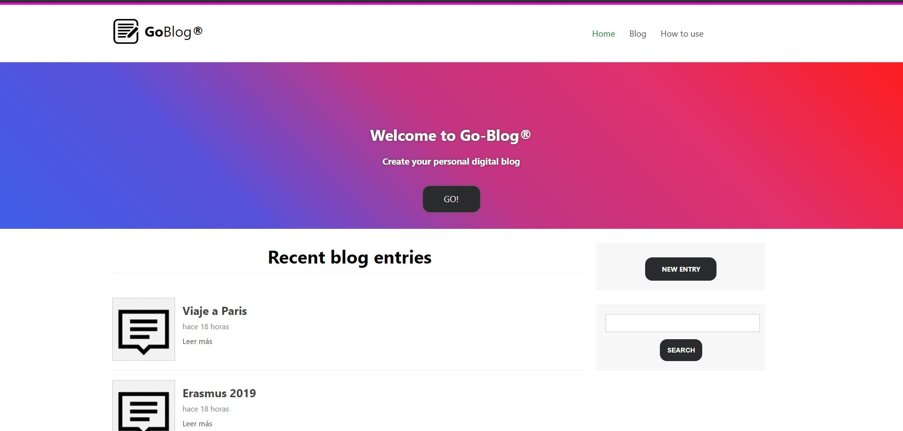

<p align="center">
    <a href="https://github.com/badges/shields/graphs/contributors" alt="Contributors">
        </a>
    <a href="#backers" alt="Backers on Open Collective">
        </a>
    <a href="#sponsors" alt="Sponsors on Open Collective">
        </a>
    <a href="https://github.com/badges/shields/pulse" alt="Activity">
        </a>
    <a href="https://circleci.com/gh/badges/shields/tree/master">
        </a>
    <a href="https://circleci.com/gh/badges/daily-tests">
        </a>
    <a href="https://coveralls.io/github/badges/shields">
        </a>
    <a href="https://lgtm.com/projects/g/badges/shields/alerts/">
        </a>
    <a href="https://github.com/badges/shields/compare/gh-pages...master">
        </a>
    <a href="https://discord.gg/HjJCwm5">
        </a>
</p>
<!-- PROJECT LOGO -->
<br />
<div align="center">
  <a href="https://github.com/othneildrew/Best-README-Template">

  </a>

  <h3 align="center">#GoBlog</h3>

  <p align="center">
    <br />
    <a href="https://github.com/othneildrew/Best-README-Template"><strong>Explore the docs »</strong></a>
    <br />
    <br /> ·
    <a href="https://github.com/othneildrew/Best-README-Template/issues">Report Bug</a>
    ·
    <a href="https://github.com/othneildrew/Best-README-Template/issues">Request Feature</a>
  </p>
</div>


<!-- TABLE OF CONTENTS -->
<details open="open">
  <summary>Table of Contents</summary>
  <ol>
    <li>
      <a href="#about-the-project">About The Project</a>
      <ul>
        <li><a href="#built-with">Built With</a></li>
      </ul>
    </li>
    <li>
      <a href="#getting-started">Getting Started</a>
      <ul>
        <li><a href="#installation">Installation</a></li>
      </ul>
    </li>
    <li><a href="#usage">Usage</a></li>
    <li><a href="#contributing">Contributing</a></li>
    <li><a href="#license">License</a></li>
    <li><a href="#contact">Contact</a></li>
  </ol>
</details>


<!-- ABOUT THE PROJECT -->
## About The Project 
<div align="center">
 
  </div>
  
This application (SPA) is a personal blog where you can save your personal entries.

* The user can register new entries, delete them and edit them.

* The user can also search the created entries.

* On the home page the user will find the first 5 entries and can also see the creation date.

* In the blog section the user will have all their entries saved in order of date and with their respective creation date.

### Built With

* [Vuejs](https://vuejs.org/)
* [Nodejs](https://nodejs.org/es/)
* [MongoDB](https://www.mongodb.com/)
* [Express](https://expressjs.com/)


<!-- GETTING STARTED -->
## Getting Started

### Installation

To run the app locally just follow the next steps:

* Download the files or clone the repo.

* Install node modules in the main directory 
```sh
   npm install
   ```
* Go to server directory
 ```sh
   cd server
   ```
* Run the app 
 ```sh
   node server.js
   ```
* Access your local server on 2900 port.

### Prerequisites

Get NodeJS.
Get MongoDB.

* npm
  ```sh
  npm install npm@latest -g
  ```

<!-- CONTRIBUTING -->
## Contributing

Contributions are what make the open source community such an amazing place to be learn, inspire, and create. Any contributions you make are **greatly appreciated**.

1. Fork the Project
2. Create your Feature Branch (`git checkout -b feature/AmazingFeature`)
3. Commit your Changes (`git commit -m 'Add some AmazingFeature'`)
4. Push to the Branch (`git push origin feature/AmazingFeature`)
5. Open a Pull Request


<!-- LICENSE -->
## License

Distributed under the MIT License. See `LICENSE` for more information.

## Deployment


<!-- CONTACT -->
## Contact

Lope Martínez Alcalá - [@lopemaal](https://twitter.com/lopemaal) - martinezalcala@hotmail.com

Project Link:


